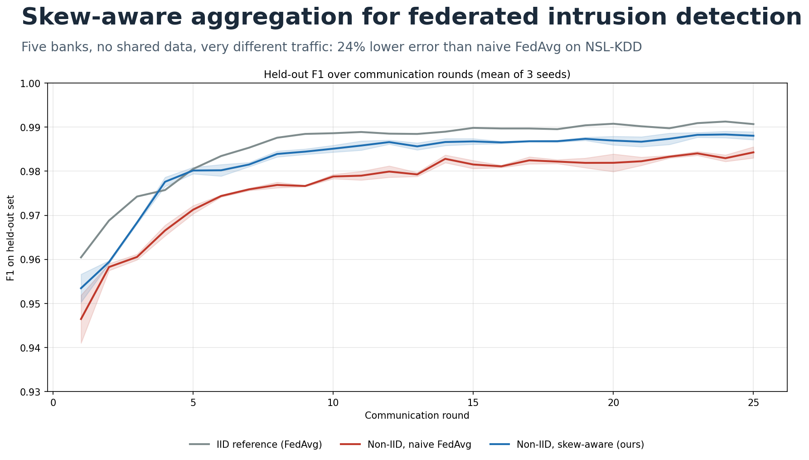
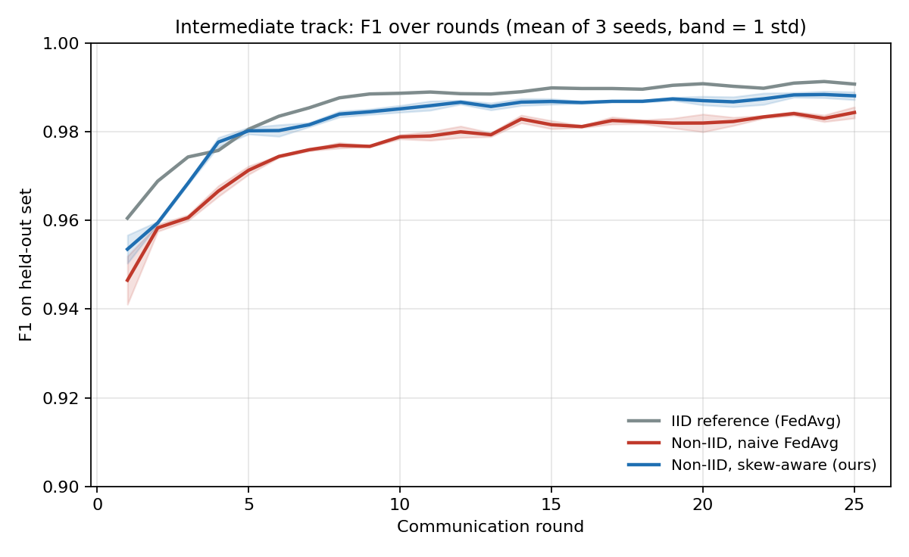
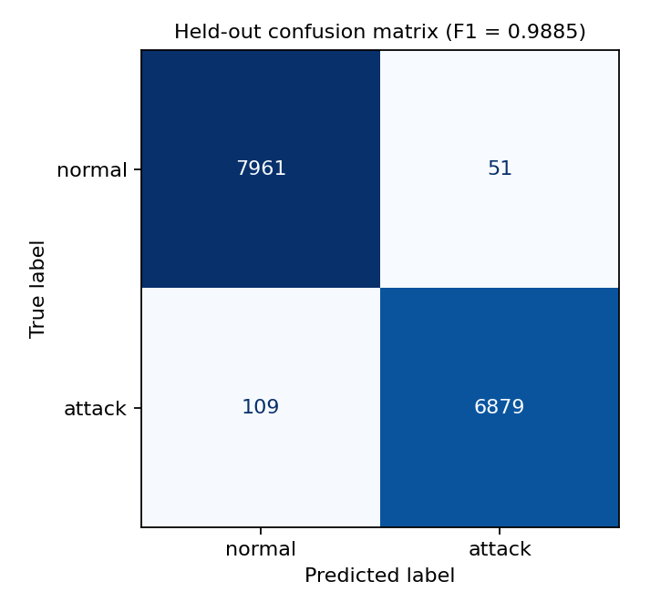

# Skew-Aware Aggregation for Federated Intrusion Detection

**Subtitle:** Fixing FedAvg when five banks see very different traffic: 24% lower error on NSL-KDD

**Track submitted:** Intermediate

## Headline result (Intermediate track)

F1 on the organizers' 15,000-row held-out set, mean of 3 training seeds. Same 128-64 MLP, 25 rounds, 2 local epochs, learning rate 0.1 and client split for both rows. Only the aggregation differs.

| Method | Held-out F1 | KDDTest+ F1 |
|---|---|---|
| Naive FedAvg on skewed clients (before) | 0.9843 +/- 0.0013 | 0.7669 |
| **Skew-aware aggregation (after)** | **0.9880** +/- 0.0009 | 0.7786 |
| IID reference (FedAvg, upper bound) | 0.9907 | 0.7709 |

The classification error (1 - F1) falls by 23.9%, and the method closes about 59% of the gap between skewed FedAvg and the IID reference. The exported model (`model_scripted.pt`, `submission.json` in the repo root, seed 0) scores 0.9885 F1 (precision 0.9926, recall 0.9844) on the held-out set.

*Held-out F1 over communication rounds, mean of 3 seeds (band = 1 standard deviation).*

## Problem

Five banks cannot pool traffic data, so they train locally and average model updates. Their traffic is very different: in our Dirichlet split (alpha = 0.3) client 4 is 4% attack, clients 0 and 1 are 81% and 86% attack, and client 2 holds 48,000 rows, nearly half the data. Naive FedAvg weights clients by data size, so each update is pulled toward its own class balance and the largest client dominates.

## Method

1. **Logit-adjusted local loss.** During local training only, each client adds the log-odds of its own label prior to the logit. The network learns class evidence rather than the local class balance.
2. **Square-root size weights.** Bigger clients still count for more, but no single client can dominate the average.
3. **Server momentum (0.5).** Smooths the round-to-round oscillation that skewed clients cause.

## Ablation (seed 0, held-out F1)

| Configuration | Held-out F1 | KDDTest+ F1 |
|---|---|---|
| 1. Naive FedAvg | 0.9852 | 0.7695 |
| 2. + logit-adjusted local loss | 0.9849 | 0.7693 |
| 3. + square-root client weights | 0.9866 | 0.7771 |
| 4. + server momentum (full method) | 0.9885 | 0.7830 |

What worked and what did not: the logit adjustment alone did nothing measurable (-0.0003). Square-root weights and momentum carry most of the gain. The improvement is +0.0038 F1, about three standard deviations of the seed noise, so it is real but modest. A FedProx penalty (mu = 0.01) matched FedAvg to within 0.001 in early sweeps and was dropped.

*Confusion matrix of the exported model on the 15,000-row held-out set.*

## Evaluation

We rebuilt the starter pipeline with its fixed seed. The reserved 15,000 rows are identical to `test_public.csv`, so we recovered their labels and score models the way the organizers will. The starter notebook scores on KDDTest+, a harder file with shifted attack mix; we report it as a secondary check. F1 there is about 0.77 to 0.78 for all methods because of the known NSL-KDD train/test shift, and our method still leads.

## Limitations

The gain is modest on a strong model. Results come from 5 simulated clients on CPU, and the split uses a single Dirichlet draw (seed 42). Other skew patterns were not tested.

## Reproduce

Run `federated_ids_intermediate.ipynb` top to bottom (about 12 minutes on CPU). It downloads NSL-KDD, builds the splits, runs every experiment and writes `model_scripted.pt` and `submission.json`. See `README.md`.
